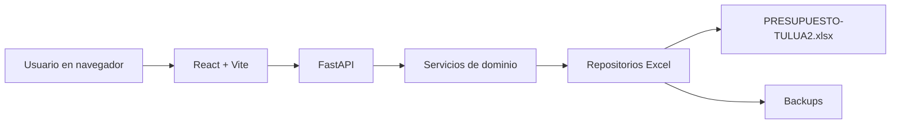
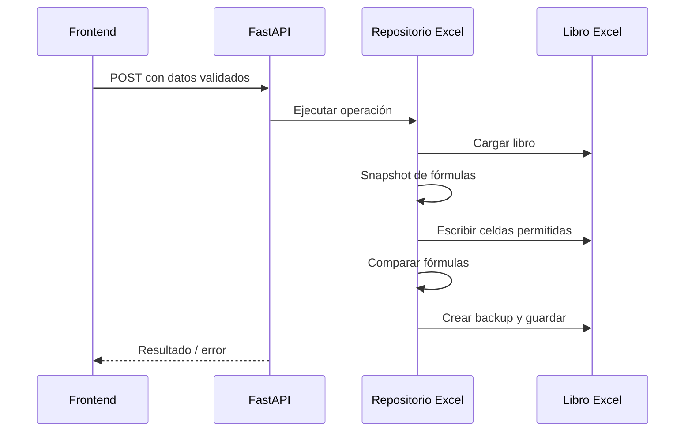

# Arquitectura Del Proyecto

## Vista General

La aplicación se divide en tres capas:

1. Frontend React/Vite para la interacción del usuario.
2. Backend FastAPI para API, validación y reglas de negocio.
3. Capa Excel con repositorios especializados que leen/escriben `PRESUPUESTO-TULUA2.xlsx`.



## Backend

Ruta base:

```text
04_implementation/backend
```

Responsabilidades:

- Exponer endpoints REST.
- Validar entradas con Pydantic.
- Encapsular reglas de negocio.
- Proteger fórmulas del libro Excel.
- Crear backups antes de guardar.

Módulos principales:

- `app/main.py`: creación de app FastAPI, CORS y rutas.
- `app/api`: endpoints por módulo.
- `app/schemas`: modelos Pydantic.
- `app/services`: servicios de dominio y generación de códigos.
- `app/excel`: lectura, escritura, backups y verificación de fórmulas.

## Frontend

Ruta base:

```text
04_implementation/frontend
```

Responsabilidades:

- Presentar módulos de Materiales, APUs y Presupuesto.
- Mantener estado temporal de formularios.
- Consumir API local.
- Aplicar diseño responsive e identidad institucional.

Módulos principales:

- `src/app/App.tsx`: navegación principal.
- `src/api`: cliente API y funciones por recurso.
- `src/features/materials`: búsqueda y creación de materiales.
- `src/features/apus`: búsqueda y creación de APUs.
- `src/features/budget`: armado y guardado de presupuesto.
- `src/store`: estado temporal con Zustand.
- `src/styles/main.css`: estilos institucionales.

## Capa Excel

El libro Excel es fuente de verdad. La aplicación solo escribe en rangos controlados.

Reglas técnicas:

- Antes de guardar se toma snapshot de fórmulas.
- Después de modificar se compara el snapshot.
- Si cambian o desaparecen fórmulas existentes, el guardado falla.
- Las fórmulas nuevas deben registrarse como permitidas en la operación.
- Se crea backup antes de reemplazar el archivo principal.

Repositorios:

- `materials_repository.py`: catálogo `L-MATERIALES`.
- `apu_repository.py`: bloques en `APU'S`.
- `budget_repository.py`: hojas nuevas de presupuesto.
- `labor_repository.py`: mano de obra.
- `crew_repository.py`: cuadrillas.

## Flujo De Guardado



## Puertos Locales

- Backend: `http://127.0.0.1:8000`
- Frontend: `http://127.0.0.1:5173`

## Riesgos Técnicos

- Si el archivo está abierto en Excel, Windows puede bloquear escritura.
- `openpyxl` no recalcula fórmulas; Excel recalcula al abrir si el libro queda marcado para cálculo automático.
- Si cambian las filas modelo del Excel, deben actualizarse las constantes de plantillas en los repositorios correspondientes.
